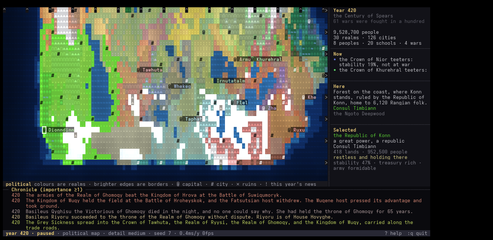

# Rise and Fall of Empires

A lo-fi, passive world simulator for the terminal. Leave it running in a corner
of the screen and fictional peoples, cities, kingdoms, empires, faiths and
magical orders rise, quarrel, split and fall on a procedurally generated map —
rivers and rain shadows first, then the people who settle them, then the states
they build and lose. Nothing asks anything of you. When something catches your
eye you can stop time, walk the map, open a realm and read why its stability is
sliding, follow a relic across six centuries, or ask for the last fifty years in
plain sentences. Then put it back in the corner. It is written in Rust with
**zero dependencies**: the terminal layer, the noise, the random numbers, the
save format and the languages are all in the tree.



*Seed 7 in its 420th year. Regenerate with `tools/screenshot.sh`.*

## Install

From a checkout:

```sh
cargo install --path .          # puts `empires` in ~/.cargo/bin
```

Or build in place:

```sh
cargo build --release && ./target/release/empires
```

Tagged releases carry tarballs for `x86_64-unknown-linux-gnu`,
`x86_64-unknown-linux-musl` (static, runs anywhere) and
`aarch64-unknown-linux-gnu`, each containing the binary, the README, the
changelog and the licences:

```sh
tar xzf empires-v0.1.0-x86_64-unknown-linux-musl.tar.gz
./empires-v0.1.0-x86_64-unknown-linux-musl/empires
```

**Requirements.** Linux, and a terminal with 24-bit colour — foot, kitty,
alacritty, wezterm, ghostty, gnome-terminal, konsole and most others. A window
of 100×30 or larger gets the sidebar; smaller still works, with less on screen.
`--ascii` drops the box-drawing and map glyphs for plain ASCII. Building needs
a Rust toolchain no older than the `rust-version` in `Cargo.toml`, and nothing
else: there is no `~/.cargo` full of crates to fetch.

## Status

Pre-1.0 and honest about it. The simulation and the interface are complete and
stable enough to live with, but:

- **The save format may change.** Old files keep loading — that is designed in,
  and tested — but a world saved today may not be readable by a build from six
  months' time if the framing changes. See the format's rules in
  [`src/ser.rs`](src/ser.rs).
- **A given seed's history is not promised across versions.** Any change to the
  balance or to the order of random draws produces a different world from the
  same number. Those changes are marked *world-changing* in
  [`CHANGELOG.md`](CHANGELOG.md).
- **Linux only.** `src/term.rs` talks to termios through hand-written FFI with
  the struct layouts for x86_64 and aarch64 glibc and musl. macOS and the BSDs
  would need their own; Windows would need much more.

## Running

```sh
empires                       # a new random world
empires --seed 42             # replay a particular world
empires --ascii               # plain ASCII glyphs
empires --headless 800        # no UI: print 800 years of chronicle
```

Options: `--seed N`, `--width W --height H` (default 160×64), `--detail
low|medium|high`, `--headless N`, `--min-importance 0-3` (headless filter),
`--stats` (balance metrics per century, with `--headless N`), `--bench`
(ms/year and per-phase timings, with `--headless N`), `--save FILE`,
`--load FILE`, `--ascii`, `--no-mouse`, `--tour` (show the introductory card
again), `--mkconfig`, `--snapshot PATH` (render one frame to PATH.txt and
PATH.html; combine with `--layer` and `--cols/--rows`), `--version`, `--help`.

## Playing

Keys follow vim conventions: a count before a motion repeats it (`12j`,
`3]`, `5.`), `gg`/`G` jump, `zz` centres, `zi`/`zo` zoom, `:` opens a
command line, `/` searches, `ZZ` quits. Arrow keys, Shift/Ctrl+arrows,
PageUp/PageDown and the mouse work too. Press `?` in the game for the
full key list.

| key | action |
|---|---|
| Space, `+`/`-`, `.` | pause, change speed (0.5 to 100 years/second), step a year |
| `h j k l` / arrows | move the cursor; `H J K L` or Shift+arrows move fast, Ctrl+arrows faster |
| `0` `$` Home `zz` | left edge, right edge, centre of the world, centre on cursor |
| `zi` `zo` | zoom in / out (1 to 4 world cells per character; the whole world fits at 2) |
| Tab / Shift+Tab | map layer: political, terrain, culture, mana, population, biomes |
| Enter / `s` / Esc | open / select what is under the cursor / clear the selection |
| `gg` or `G` | jump to the selected thing |
| `]` `[` and `}` `{` | next / previous realm, next / previous city |
| `t` | go to the top story in the storyteller panel |
| `r` | a recap of the last fifty years (of the selected realm, if one is selected) |
| `/name`, `n`, `N` | search realms, cities, people, schools, wars, places, relics; cycle matches |
| `f` | follow: the cursor jumps to each major event as it happens |
| `e` | lists: realms, cities, peoples, schools, persons, wars, places, relics, prophecies |
| `c` | the full chronicle (`f` cycles importance, `/` filters by text) |
| `x` | the Hand of Fate: intervene in the selected realm |
| `D`, `v` | cycle simulation detail; filter the event log |
| `?` | help |

In lists and detail pages: `j`/`k` scroll, Ctrl-d/Ctrl-u half a page,
`gg`/`G` top and bottom, `m` shows the thing on the map, Enter opens,
bracketed letters follow links (`[r]` ruler, `[c]` people, `[k]` capital,
`[f]` family and so on), Backspace goes back, Esc or `q` returns.

Mouse: click to select, click again to open, wheel to scroll, click a
chronicle line or a sidebar entry to jump to it. Pass `--no-mouse` (or
`:mouse`) to leave the mouse to the terminal for selecting text.

### Commands

| command | effect |
|---|---|
| `:w [name]`, `:e name`, `:saveas name`, `:saves` | save, load, save under a new name, list saves (kept in `~/.local/share/empires`) |
| `:autosave N` | autosave every N years once a save file is set (default 100; quitting also saves) |
| `:speed 25`, `:detail high`, `:layer culture`, `:zoom 2`, `:theme paper` | settings |
| `:find name` | search and jump |
| `:until 900`, `:step 50` | run to a year and pause; advance N years at once |
| `:new [seed]` | start a fresh world without restarting |
| `:story` | go to the top story |
| `:recap [N]` | the digest of the last N years (default 50); `r` on the map does the same |
| `:follow on`, `:log 2` | jump to major events as they happen; least importance shown in the event log |
| `:legend` | the one-line key under the map (on by default) |
| `:tour` | show the introductory card again |
| `:mute battle` | hide an event kind from the feeds (toggle); `:mute` lists |
| `:set key value`, `:map <from> <to>`, `:unmap key`, `:maps` | runtime versions of the config file |
| `:mkconfig`, `:config` | write a commented config template; show its path |
| `:fate N` | apply Hand of Fate option N to the selected realm |
| `:q`, `:wq`, `:q!`, `ZZ` | quit (saving if a save file is set), save and quit, quit without saving |

### Saving

`empires --save ~/worlds/mine.rfe` starts a world that autosaves every
100 years and on quit; `empires --load ~/worlds/mine.rfe` continues it.
Inside the game `:w` saves to `~/.local/share/empires/world-SEED.rfe` and
`:e NAME` loads. Saves are self-contained and a loaded world continues
exactly as it would have (the simulation is deterministic per seed).

The file is a small header (magic, format version, body length and an
FNV-1a checksum) followed by one tagged, length-prefixed chunk per section
of the world. A reader skips chunks it does not know and defaults the ones
that are missing, so saves survive new versions of the game; damage is
reported as a checksum error rather than a mangled world. Saves written by
older versions still load. See the module docs in `src/ser.rs` for the rule
on adding a field.

### Config file

`empires --mkconfig` writes `~/.config/empires/config` (or
`$XDG_CONFIG_HOME/empires/config`):

```
detail = medium        # low | medium | high
speed = 5              # years per second at start (0.5 1 2 5 10 25 50 100)
theme = default        # default | phosphor | amber | paper | dusk
mouse = on
ascii = off
autosave = 100         # years between autosaves when a save file is set (0 = off)
width = 160
height = 64
log = 1                # minimum importance shown in the event log (0-3)
follow = on            # jump the cursor to major events
zoom = 1               # 1-4, how many world cells per character

tune.decadence_growth = 0.0045   # override any field of sim::tuning::Tuning

map w k                # vim-style remaps: map <S-Up> K, map <C-p> :, map ; :
```

Every line is optional. `tune.<field>` reaches any of the simulation's
balance constants by name — a bad name is reported when the file is read, not
silently ignored — so the shape of the world is adjustable without rebuilding.

### The storyteller

The sidebar's **Now** panel picks the three most interesting things in the
world at the moment: the biggest war and who is winning it, a great realm
about to break, a new empire, a plague, a prophecy about to run out. `t`
jumps to the top one.

### Reading the world

Nothing asks you to decode a percentage. Stability reads *steady*,
*restless*, *troubled* or *on the brink*; a treasury is *bankrupt*, *poor*,
*solvent* or *rich*; an army is *outmatched*, *matched* or *formidable*
against its neighbours; a realm is *a small realm* or *a great power*; a
school of thought is *a local cult*, *spreading* or *a great faith*. The
numbers stay beside the words in lists, where they are there to compare.

**Causes sit next to effects.** A realm's page carries a **Why** block: what
is pulling its stability up or down, ranked and in words — *overextended:
383 lands, but the crown can govern about 250*, *the court has rotted
through with luxury*, *the ruler is beloved* — with each contribution in
points, adding up to the value stability is drifting towards. A war's page
says who is ahead and why (hosts, generals, terrain, trouble at home) and
what a peace signed this year would look like. A person's page opens with
one sentence of standing: *a beloved ruler of twenty years*.

**The map says what it is.** At zoom 1 each realm's name is written beside
its capital, and a one-line legend under the map says what the current
layer's colours and glyphs mean (`:legend` turns it off). The sidebar's
**Here** block is a plain sentence about whatever the cursor sits on:
*Steppe on the coast, where Fil stands, ruled by the Lystzylese
Commonwealth, home to 4,470 Whendan folk.*

**Digests.** `r` or `:recap` summarises the last fifty years — realms risen
and fallen, wars begun and ended, rulers dead, cities founded and sacked,
schools founded, who grew and who shrank — for the world, or for the
selected realm. `:recap 200` looks further back. Coming back to the map
after a while on another screen, the sidebar says in one line what you
missed.

On a first run (no config file and no `~/.local/share/empires`) a short
card explains the map, that time is already running, and the four keys that
matter. Any key dismisses it for good; `--tour` or `:tour` brings it back.

## How the world works

**Geography.** Fractal elevation shaped into continents; latitude and
altitude set temperature; prevailing winds carry moisture off the sea and
drop it on windward slopes, leaving rain shadows behind. Depressions are
filled, rivers flow downhill to the sea, biomes follow from climate, and a
mana field with a few ley nexuses marks where magic runs strong. Mountain
ranges, forests, deserts, seas, rivers and islands are labelled as features
and named by the first people to reach them.

**Peoples.** Each race has a homeland, favoured biomes, a lifespan and a
temperament. Population grows toward the land's carrying capacity and
migrates into empty country. Cultures under a foreign crown slowly
assimilate; communities cut off from their kin by sea or mountains drift
into new peoples with daughter languages.

**Realms.** Tribes form where people are dense, expand cell by cell with
costs set by terrain and distance from the capital, found cities on rivers
and coasts, and climb from chiefdom to kingdom to empire. Stability depends
on the ruler, overextension, foreign subjects, war-weariness and decadence;
when it fails there are revolts, civil wars and, for the great, shattering.

**War.** Tension builds along borders from ambition, culture, claims and
rival faiths, and cools with trade and time. Battles are shaped by the
defender's terrain, generals and rulers' valour; cities fall to siege and
are sacked or spared; peace comes with exhaustion.

**Schools of thought.** Arcane orders, faiths and philosophies are founded
where mana is high or a people is mystical. They spread along trade and
conquest, are adopted as state doctrine or persecuted, split in schisms, and
an arcane order that reaches too far can unmake the city that raised it.

**Stories.** Rulers found dynasties whose heirs and rival claimants carry
their blood; cruel rulers become tyrants, renowned generals and poets become
legends. Seers utter prophecies with deadlines that later come true or fail.
Relics are forged for great rulers, wonders and schools, carried off as
spoils, lost in sacks and dug up centuries later, and give their holders a
little strength or standing.

**Chronicle.** Everything notable is written as prose and indexed by the
realms, cities, people and schools involved, so every detail page carries
its own history. It does not grow for ever: past `chronicle_cap` events
(60,000 by default) the oldest small entries are dropped, trivia first, and
events of importance 2 and 3 are kept whatever happens.

## Development

`cargo build` produces a warning-free build. Useful checks:

```sh
cargo test
./target/release/empires --seed 3 --headless 2000 --detail high | tail -20
./target/release/empires --seed 3 --headless 1500 --stats             # balance metrics
./target/release/empires --seed 3 --headless 1500 --bench             # where a year goes
./target/release/empires --seed 3 --headless 300 --snapshot /tmp/frame --layer political
python3 tools/ptytest.py                              # drives the UI in a pty
```

The simulation is deterministic: the same seed always produces the same
history, and a saved world continues identically. Keep it that way (use
ordered maps, never iterate a HashMap in the simulation, and keep the order
in which cells and realms are visited stable wherever it feeds a random draw
or a tie-break).

Cost scales with the map. No phase may walk the whole map once per realm:
`World::owner_cells` keeps each realm's own land in map order, maintained by
`claim` and `fall` and rebuilt by `recompute`, and `cells_of_ref` reads it.
`--bench` says where a year actually goes. Over 1500 years at high detail a
year costs about 0.44 ms at 160x64 and about 2.1 ms at 400x160, which has
6.25 times the cells; the cost should stay roughly proportional to the map
rather than climbing with the number of realms that have ever lived.

Source layout: `src/geo.rs` terrain, `src/lang.rs` languages and names,
`src/sim/` the simulation (`politics`, `war`, `magic`, `people`, `events`,
`stories`, `genesis`, `chronicle`, `prose`, which writes every sentence the
chronicle prints, and `explain` for why things are as they are), `src/ser.rs`
save files, `src/config.rs` and `src/theme.rs`, `src/term.rs` the raw
terminal layer, `src/ui/` the interface (`words` for numbers in plain
language, `recap` for the digest), `src/stats.rs` the balance harness.

Further reading: [`docs/ARCHITECTURE.md`](docs/ARCHITECTURE.md) for the tick
pipeline, the data model and how prose and explanation relate to the
simulation; [`CONTRIBUTING.md`](CONTRIBUTING.md) for the rules and for how to
add a tuning constant, a save field, a `:` command or a chronicle event;
[`tools/README.md`](tools/README.md) for the test and screenshot scripts.

## License

Dual licensed under either of

- Apache License, Version 2.0 ([LICENSE-APACHE](LICENSE-APACHE) or
  <https://www.apache.org/licenses/LICENSE-2.0>)
- MIT license ([LICENSE-MIT](LICENSE-MIT) or
  <https://opensource.org/licenses/MIT>)

at your option.

Unless you explicitly state otherwise, any contribution intentionally
submitted for inclusion in this work by you, as defined in the Apache-2.0
license, shall be dual licensed as above, without any additional terms or
conditions.
